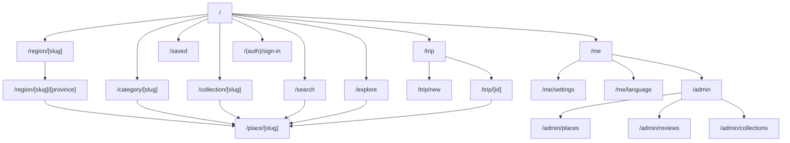
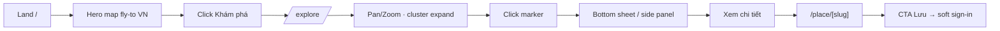
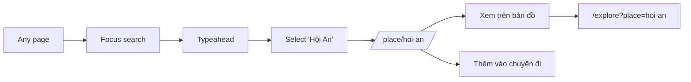
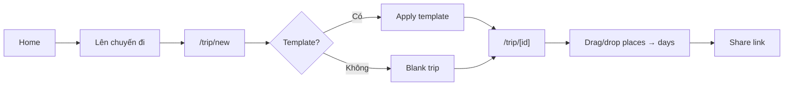
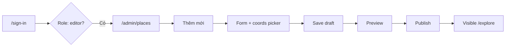
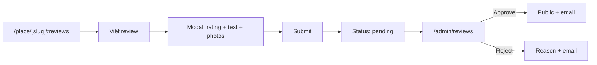
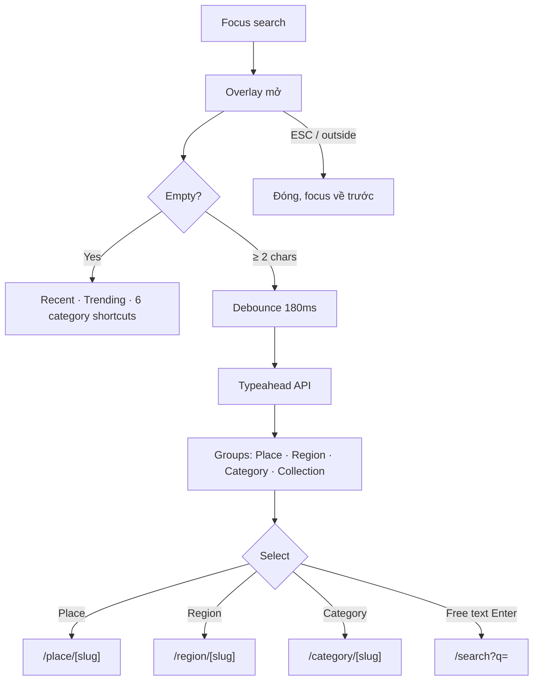
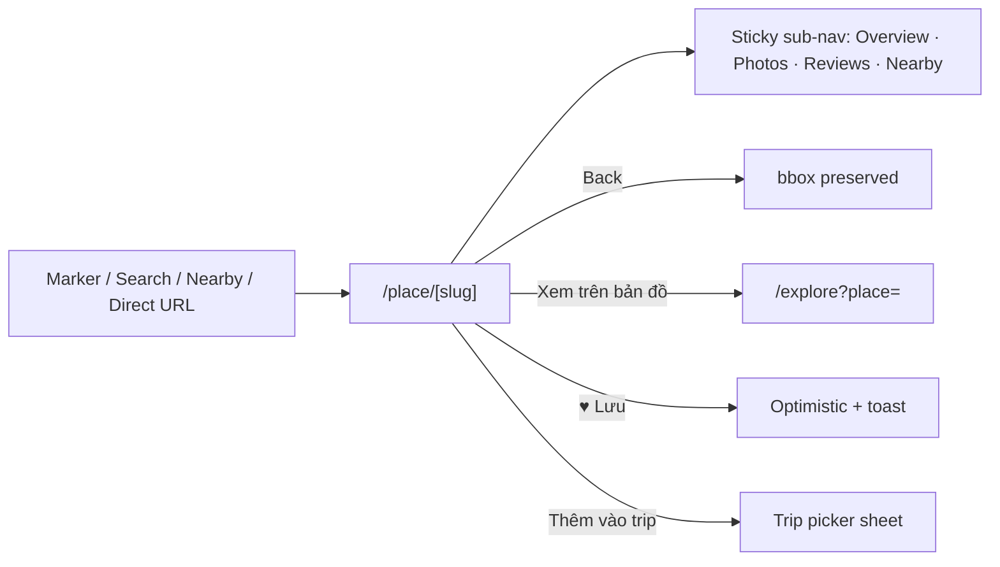
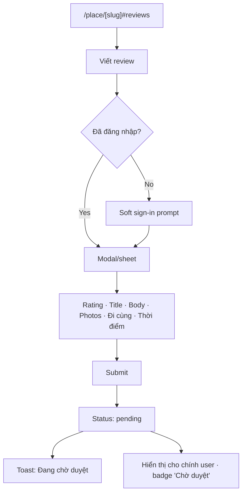
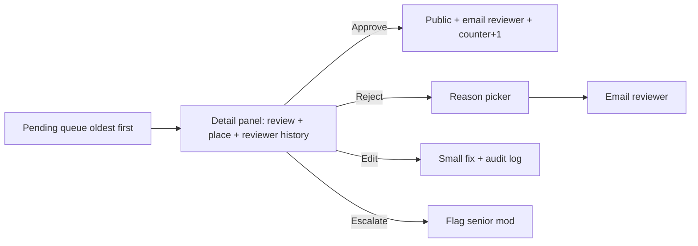

# Map-VN — Information Architecture

> Nền tảng bản đồ trải nghiệm Việt Nam. Tài liệu này định nghĩa cấu trúc thông tin, điều hướng và các luồng cốt lõi.
> Tham chiếu design tokens & component: [PRODUCT_AND_DESIGN_SYSTEM.md](PRODUCT_AND_DESIGN_SYSTEM.md).

## Mục lục
1. [Nguyên tắc IA](#1-nguyên-tắc-ia)
2. [Sitemap](#2-sitemap)
3. [Page Hierarchy](#3-page-hierarchy)
4. [User Flows](#4-user-flows)
5. [Desktop Navigation](#5-desktop-navigation)
6. [Mobile Navigation](#6-mobile-navigation)
7. [Search Flow](#7-search-flow)
8. [Place Detail Flow](#8-place-detail-flow)
9. [Review Flow](#9-review-flow)
10. [Cross-cutting Rules](#10-cross-cutting-rules)

---

## 1. Nguyên tắc IA

- **Map-first** — bản đồ là trục chính, không phải feed.
- **2 trục khám phá song song** — theo *địa lý* (region → province → place) và theo *chủ đề* (category / collection).
- **Progressive disclosure** — home → explore → detail → trip, mỗi bước thêm một lớp dữ liệu.
- **URL-as-state** — filter, bbox, selection đều phản chiếu trong URL để share-able và back/forward chính xác.
- **3-tap rule** — mọi nội dung Tier 1–2 đạt được trong ≤ 3 tap từ trang chủ.

---

## 2. Sitemap

### 2.1 Cây thư mục logic

```
Map-VN
├── /                              Home (hero map + featured rails)
├── /explore                       Map Explorer (URL-state)
│   └── ?bbox= &cat= &q= &place=
├── /search                        Search results
├── /place/[slug]                  Place detail
│   ├── #overview · #photos · #reviews · #nearby
├── /region/[slug]                 Region hub (Bắc / Trung / Nam)
│   └── /[province]                Province listing
├── /category/[slug]               Category hub
├── /collection/[slug]             Curated collection
├── /trip
│   ├── /                          User trips list
│   ├── /new
│   └── /[id]                      Trip detail (map + itinerary)
├── /saved                         Saved places
├── /me
│   ├── /settings
│   └── /language
├── /(auth)/sign-in · /sign-up
├── /admin
│   ├── /places · /places/[id]
│   ├── /reviews                   Moderation queue
│   └── /collections
├── /about · /help · /privacy · /terms
└── /design                        Internal showcase
```

### 2.2 Sitemap diagram (Mermaid)



### 2.3 URL convention
- Slug = kebab-case, không dấu (`ha-long-bay`, `hoi-an`).
- `/explore` dùng query string (không hash) để SSR & share thân thiện.
- Locale prefix optional: `/en/place/hoi-an` — mặc định VI không prefix.

---

## 3. Page Hierarchy

| Tier | Routes | Mục đích | SEO |
|---|---|---|---|
| **0 — Entry** | `/`, `/about` | First impression, hero map | ✅ |
| **1 — Discovery** | `/explore`, `/search`, `/region/*`, `/category/*`, `/collection/*` | Khám phá | ✅ |
| **2 — Detail** | `/place/[slug]`, `/region/[slug]/[province]` | Nội dung sâu | ✅ canonical |
| **3 — Personal** | `/trip/*`, `/saved`, `/me/*` | User-owned | ❌ |
| **4 — Account** | `/(auth)/*` | Auth | ❌ |
| **5 — Admin** | `/admin/*` | CMS / moderation | ❌ |
| **6 — System** | `/help`, `/privacy`, `/terms`, `/design` | Utility | partial |

Quy tắc:
- Tier 0–2 SSR + `generateMetadata` cho OG / sitemap.xml.
- Tier 3+ CSR + auth guard, `noindex`.
- Mọi Tier 2 page có nút "Xem trên bản đồ" về `/explore` với bbox preset.

---

## 4. User Flows

### 4.1 Flow A — First-time visitor



### 4.2 Flow B — Goal-oriented (tìm Hội An)



### 4.3 Flow C — Trip planner



### 4.4 Flow D — Contributor



### 4.5 Flow E — Reviewer



---

## 5. Desktop Navigation

### 5.1 Top bar (sticky, glass khi cuộn qua hero)

```
┌─────────────────────────────────────────────────────────────────┐
│  [LOGO]   Khám phá ▾   Vùng miền ▾   Bộ sưu tập   Trip        │
│           [🔍  Tìm địa điểm, vùng, chủ đề…       ]              │
│                                       [🌗] [VI▾] [♥] [👤]      │
└─────────────────────────────────────────────────────────────────┘
```

- **Khám phá** mega-menu: 6 category cards (icon + thumbnail).
- **Vùng miền** mega-menu: 3 columns (Bắc / Trung / Nam) → tỉnh thành.
- **Bộ sưu tập** → `/collection`.
- **Trip** → `/trip` (sign-in soft-gate khi cần).
- **Search pill**: focus → overlay full-width.
- **Right cluster**: theme toggle · locale · saved (♥) · avatar.

### 5.2 Side rail (`/explore` chỉ ở ≥ lg)

- Filter panel collapsible: categories · region chips · price/free · "open now".
- Result list sync với map viewport (bbox).
- Width 360px khi mở, 56px khi thu gọn (icons-only).

### 5.3 Footer

Tier 6 links + social + copyright + locale fallback.

---

## 6. Mobile Navigation

Pattern: **bottom tab bar + contextual top bar + bottom sheet**.

```
┌──────────────────────────┐
│  ←  Hội An       ⋯  ♥   │  ← Top bar (contextual)
├──────────────────────────┤
│                          │
│         [ MAP ]          │
│                          │
│  ╭────────────────────╮  │
│  │  Selected place    │  │  ← Sheet · 3 snap points
│  │  peek / half / full│  │     88 · 50% · 90%
│  ╰────────────────────╯  │
├──────────────────────────┤
│  🗺   🔍   ❤   🧳   👤   │  ← Bottom tab bar
│  Map  Search Saved Trip Me│
└──────────────────────────┘
```

### 6.1 Tabs (5 max)
1. **Map** — `/explore` (default).
2. **Search** — `/search` overlay.
3. **Saved** — `/saved`.
4. **Trip** — `/trip`.
5. **Me** — `/me` (hoặc `/sign-in` nếu chưa auth).

### 6.2 Rules
- Tab bar ẩn khi: sheet full snap · modal · map fullscreen.
- Top bar morph: home (logo + search icon) ↔ detail (back + title + actions) ↔ explore (search pill + filter chip).
- Gesture: swipe-down hạ snap, swipe-up nâng. Back gesture iOS/Android respected.
- Reachability: CTA chính (Lưu / Thêm vào trip) đặt trong thumb-zone (1/3 dưới).

---

## 7. Search Flow

Search là **first-class** — không lẫn vào navbar.

### 7.1 Entry points
- Pill ở top bar (mọi page).
- Tab Search ở mobile.
- Phím `/` focus search (desktop).
- Empty state `/explore` gợi ý: "Tìm 'Đà Nẵng', 'biển miền Trung', 'phở Hà Nội'…".

### 7.2 Diagram



### 7.3 `/search` results page
- Layout: list 60% / map 40% desktop · mobile list + toggle "Xem bản đồ".
- Filter chips: Danh mục · Vùng · Có ảnh · Mở cửa · Sắp xếp.
- Infinite scroll, 20 items / batch, restore scroll khi back.
- URL: `/search?q=ha+long&cat=beach&region=bac&sort=popular`.

### 7.4 Edge cases
- Diacritics-insensitive: `ha long` ⇄ `Hạ Long`.
- 0 results → gợi ý gần nhất + "Xem trên bản đồ tỉnh X".
- Offline → cache 10 search gần nhất.

### 7.5 Latency budget
- Typeahead p95 ≤ 250ms server + 180ms debounce = cảm nhận ≤ 450ms.

---

## 8. Place Detail Flow

Place detail có 2 hình thái đồng bộ cùng dữ liệu:

| Surface | Khi nào |
|---|---|
| **Sheet / side panel** (`/explore`) | Map context, xem nhanh |
| **Full page** (`/place/[slug]`) | SEO, deep-link, scroll dài |

### 8.1 Anatomy (top → bottom)

1. **Hero gallery** — 4:3 main + thumbnail row, swipe mobile, lightbox khi tap.
2. **Header** — tên (Fraunces `display-lg`) · tỉnh · category chip · rating · ♥ · share.
3. **Quick actions** (sticky mobile): Chỉ đường · Lưu · Thêm vào trip · Báo cáo.
4. **Overview** — 2–3 đoạn · giờ mở cửa · giá vé · best season.
5. **Map mini** — embed 16:9 + "Mở trong bản đồ lớn" → `/explore?place=`.
6. **Photos** — masonry, "Đóng góp ảnh" CTA.
7. **Reviews** — section riêng (xem §9).
8. **Nearby** — 6 place card cùng category hoặc bán kính 10km.
9. **Collections include this** — chip list.
10. **Footer** — last updated · contributor credits · "Đề xuất chỉnh sửa".

### 8.2 Diagram



### 8.3 State variants
- **Loading** — hero shimmer + 3 lines text shimmer.
- **Draft** — chỉ editor thấy, badge "Bản nháp".
- **Removed** — 410 + "Tìm địa điểm tương tự".

---

## 9. Review Flow

### 9.1 Write review



Field rules:
- Rating 1–5 (required).
- Title optional, ≤ 80 chars.
- Body required, 30–2000 chars.
- Photos 0–6, ≤ 5MB/ảnh.
- Đi cùng: gia đình / bạn bè / một mình / công tác.
- Thời điểm đi: month-year picker.

### 9.2 Moderation (`/admin/reviews`)



SLA: median < 24h, p95 < 72h.

### 9.3 Display
- Sort: Newest · Highest · Lowest · With photos.
- Summary: avg + histogram 1–5 + count.
- Card: avatar · name · trip context · date · rating · title · text (truncate 4 lines + "Đọc thêm") · photos · 👍 helpful · ⋯ report.
- Owner controls: Edit (trong 24h) · Delete.

### 9.4 Anti-abuse
- 1 review / user / place / 30 ngày.
- Rate limit ≤ 5 review pending cùng lúc.
- Auto-flag: < 30 chars · ≥ 4 links · > 70% caps · profanity → queue priority "bot-flagged".
- Helpful chỉ user verified mới đếm.

---

## 10. Cross-cutting Rules

- **Breadcrumbs** Tier 2+ desktop: `Home › Vùng miền › Miền Trung › Hội An`.
- **404** — gợi ý search + 6 trending place.
- **Empty states** — minh hoạ + 1 CTA + 1 link giáo dục.
- **Loading** — skeleton, không spinner toàn trang trừ auth callback.
- **Toast** — top-center desktop · bottom-above-tabbar mobile.
- **Locale switch** — giữ nguyên route + query, chỉ đổi nội dung.
- **Share** — Web Share API mobile · copy-link desktop · OG image render-on-demand.
- **a11y** — landmark `<nav>` `<main>` `<aside>` · skip-to-content · focus visible · tab order theo thị giác.

---

## Phụ lục — Verification Checklist

- [ ] Mọi persona (PRODUCT_AND_DESIGN_SYSTEM.md §1.2) có entry route + success route.
- [ ] 5 deep-link mẫu chạy đúng: SSR meta · back restore · share open lại UI.
- [ ] Mọi top-level destination ≤ 2 tap từ Tier 1–2 trên mobile.
- [ ] Search typeahead cảm nhận ≤ 450ms.
- [ ] Admin review queue có timestamp + filter "older than 48h".
- [ ] Lighthouse a11y ≥ 95 trên 5 routes mẫu (`/`, `/explore`, `/place/[slug]`, `/search`, `/trip/[id]`).
